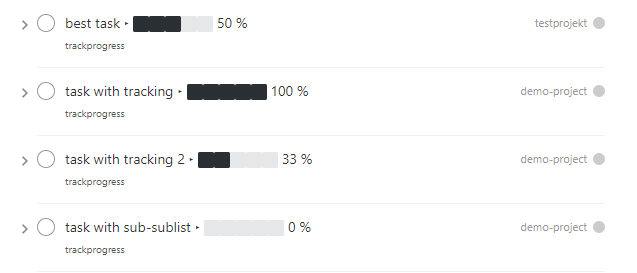
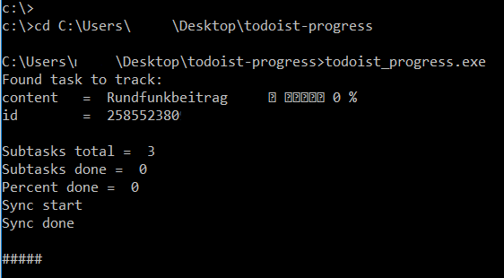

# todoist-progressbar

Adds visual progressbars to tasks and lists with subtasks



## Features
- uses unicode symbols for cross-platform support
- adds progressbars lists, sub-lists and individual tasks

## Prerequisites and notes
1. You'll need a [Todoist](https://todoist.com) premium account
2. You'll probably need a basic understanding of Python as this is my first Python project which is probably not bug-free
3. As of today is tested on Windows 10, 64Bit only
4. For optimal use this programm should run periodical on a server/computer to continuously update your tasks
5. This programm updates the "top" task of your task-lists and adds a progress bar to the existing text

**Errors could lead to broken task-descriptions or manual rework**

## usage Ubuntu
### installing requirements
- `sudo apt-get install python3-pip`
- `sudo pip3 install -r requirements.txt`
- `git clone git@github.com:6uhrmittag/todoist-progress.git`
- `cd todoist-progress/todoist-progress/`
- `echo -e "[config]\napikey=YOURAPIKEY-WITHOUTH-ANY-QUOTES" >> config.ini`
-  add a label named `trackprogress` to each list/task you want to track (only to the "top" task in the list)
### usage
- `cd todoist-progress/todoist-progress/`
- `python3 todoist_progress.py`

### Continuous progress-update
This program updates existing tasks without creating new once. It used the official sync-api and shouldn't cause any trouble while syncing.
To continuously update your tasks run this programm periodical on a server/computer

#### Ubuntu
run programm every 20Min via crontab
(see [crontab.guru](https://crontab.guru/) for setting time)

1. `sudo find / -name todoist_progress.py`
2. copy path without "todoist_progress.py" (e.g. `/home/USERNAME/todoisttest/todoist-progress/todoist-progress/`)
3. `crontab -e`
4. add: `*/20  *  * * * cd "INSERT-COPIED-PATH" && /usr/bin/python3 todoist_progress.py`

#### edit progressbar symboles
The bar is implemented by adding [unicode charaters](http://jrgraphix.net/r/Unicode/2600-26FF) to the existing text.
e.g.  ⬛⬛⬜⬜⬜ 33 %
The characters are configurable in the `config.py` file
```
progress_bar_0='⬜⬜⬜⬜⬜ '
progress_bar_20='⬛⬜⬜⬜⬜ '
progress_bar_40='⬛⬛⬜⬜⬜ '
progress_bar_60='⬛⬛⬛⬜⬜ '
progress_bar_80='⬛⬛⬛⬛⬜ '
progress_bar_100='⬛⬛⬛⬛⬛ '
```
To change the bar to e.g. empty/full bullets, just overwrite the characters with other charaters `⚫⚫⚫⚪⚪`.

#### edit progressbar seperator
The bar added to every task. To seperate the task-text from the progressbar a rare unicode charater is used.
To change the seperator just change the line `progress_seperator="‣"` in the `config.py` file. Just replace the existing charater with your choice. Remember to rename the seperator manually in todoist before running the programm again!

#### edit progressbar label
The bar added to every task with the label `trackprogress`.
The label-name can be changed in the `config.py` file in line 1:
`label_progress = "trackprogress"`
To change the label, just change the name inside the quotes.
Remember to rename the label in todoist when renaming labels!

## usage Windows
**unfortunately the windows version is not as flexible as the "raw" python version and currently just tested under Win10, 64bit***

1. add a label named `trackprogress` to each list/task you want to track (only to the "top" task in the list)
2. download `todoist_progress.exe` from [releases page](https://github.com/6uhrmittag/todoist-progress/releases)
3. add a config.ini to the same directory as the `todoist_progress.exe` (with notepad)
4. add the following to the `config.ini`:
```
[config]
apikey=YOURAPIKEY-WITHOUTH-ANY-QUOTES
```
5. open a cmd (WIN+R -> cmd) and `cd` into the directory (e.g. `cd C:\Users\username\Downloads\todoist-progress`)
6. type `todoist_progress.exe` <enter>
7. like this:



7. Done (check [https://todoist.com](todoist.com) )

## Development: python2exe
- install PyInstaller
- cmd in directory
- run `pyinstaller --path "C:\Program Files (x86)\Windows Kits\10\Redist\ucrt\DLLs\x64" --clean --onefile todoist_progress.py`

## Built With

* [Doist/todoist-python](https://github.com/Doist/todoist-python) - The official Todoist Python API library
* [PyInstaller](https://www.pyinstaller.org) - PyInstaller is a program that freezes (packages) Python programs

## Contributing

Please leave a issue in the [issue tracker](https://github.com/6uhrmittag/todoist-progress/issues)

## Versioning

I use [Github](https://github.com/6uhrmittag/todoist-progress/) for versioning. 

## Authors

* **Marvin Heimbrodt** - *Initial work* - [slashlog.de](https://slashlog.de)
