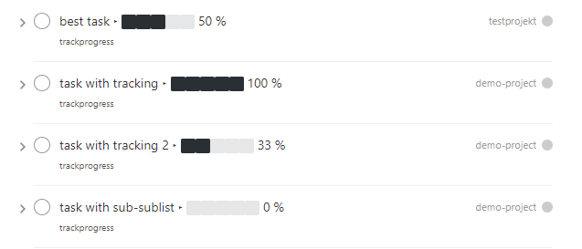
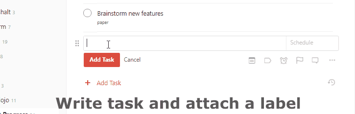
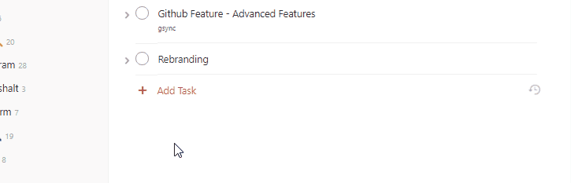

# Taskbutler

Taskbutler enriches your Todoist tasks by adding progress bars, Office365 Files and Dropbox Paper papers directly to your tasks.

[](https://codeclimate.com/github/6uhrmittag/taskbutler/maintainability)
[](https://www.codefactor.io/repository/github/6uhrmittag/taskbutler)
## Features

- ***add progress bars to task-lists in Todoist (unicode, cross-plattform)***
    - Example usage: Create a new task list "File taxes" in your "personal" Todoist project. Add the label "progressbar" to the top task and always get the status of your taxes at a glance.

- ***add and link a Word/Office365 template to tasks*** (with help of your Dropbox)
    - Example usage: Setup a letter template in Microsoft Word once and save it. Once you add the label "letter" to your Todoist task, the template gets uploaded to your Dropbox and the task get liked to Microsoft Office365. Now, by clicking the task in Todoist, Microsoft Word online opens in your browser and you can start writing.  

- ***add and link Dropbox Paper papers to tasks***
    - Example usage: Tired of the missing task-note feature in Todoist? Add the label "paper" to a task. Now, with a click on the title, you'll get a new Dropbox Paper with all its features just for this task. 

        
## Prerequisites and notes

***Taskbutler is not associated or connected with Todoist, Dropbox, Github or Microsoft.***

1. You'll need a [Todoist](https://todoist.com) premium account
2. The Dropbox Paper and Github features require a free account at Dropbox. The Microsoft Office365 feature requires a paid Office365 subscription(or a free Microsoft Office 365 Education subscription).
3. Taskbutler is tested on Ubuntu
4. For optimal use, Taskbutler should run periodical on a server/computer to continuously update your tasks

*Even though I never experienced any data loss, it's nice to know that [Todoist provides a daily backup of your data.](https://support.todoist.com/hc/en-us/articles/115001799989)*

## Setup

### install
````bash
sudo apt-get install python3-pip
sudo pip3 install --user pipenv
git clone https://github.com/6uhrmittag/taskbutler.git
git fetch && git fetch --tags
git checkout v.2.0.0
cd taskbutler
python3 -m venv taskbutler
source taskbutler/bin/activate
pip3 install --user -r requirements.txt
cp config.ini.sample config.ini
````

## configuration
Each feature can be disabled by leaving the corresponding labelname in the config.ini emtpy.
Each feature is configured in the config.ini. Open, edit and save the file to configure Taskbutler.

If you used Taskbutler before and want to change a setting: ***Remember to stop Taskbutler before changing any setting and always update your existing Todoist tasks manually according to your changes before starting Taskbutler again.***

Taskbutler is not aware of your changes and will mix and mess up your tasks.
Changes can easily be tested by using a different/new labelname. 

### Setup Progress bars
Edit the config section in config.ini:
````ini
[todoist]
apikey = 
label_progress = progressbar
progress_seperator=‣
progress_bar_0=⬜⬜⬜⬜⬜
progress_bar_20=⬛⬜⬜⬜⬜
progress_bar_40=⬛⬛⬜⬜⬜
progress_bar_60=⬛⬛⬛⬜⬜
progress_bar_80=⬛⬛⬛⬛⬜
progress_bar_100=⬛⬛⬛⬛⬛
````
#### Change progressbar symbols

The bar is implemented by adding [unicode charaters](http://jrgraphix.net/r/Unicode/2600-26FF) to the existing text.
e.g.  ⬛⬛⬜⬜⬜ 33 %

```
[todoist]
progress_bar_0=⬜⬜⬜⬜⬜
progress_bar_20=⬛⬜⬜⬜⬜
progress_bar_40=⬛⬛⬜⬜⬜
progress_bar_60=⬛⬛⬛⬜⬜
progress_bar_80=⬛⬛⬛⬛⬜
progress_bar_100=⬛⬛⬛⬛⬛
```

To change the bar to e.g. empty/full bullets, just overwrite the characters with other characters `⚫⚫⚫⚪⚪`.

#### Change progressbar seperator

To separate the task-text from the progressbar, a rare unicode character is used.
To change the separator just change the line `progress_seperator=‣` in the `config.ini` file.
````ini
[todoist]
progress_seperator=‣
````

Just replace the existing character with the character of your choice.
Remember to rename the separator manually in Todoist before running Taskbutler again!

#### Edit progressbar label

The bar added to every task with the label `progressbar`.
The label-name can be changed in the `config.ini` file:
`label_progress=progressbar`
To change the labelname after the "=".
Remember to rename the label in Todoist when renaming labels!

### Setup Dropbox features
To use any Dropbox feature you need to create a Dropbox API token. You need to create an Dropbox app for that. Don't worry, you only need to setup it once and it is only accessible for you.

Get a API key for your Dropbox(by creating a Dropbox app):

1. Go to [https://www.dropbox.com/developers/apps/create](https://www.dropbox.com/developers/apps/create)
2. Select ``Dropbox API``
3. Select ``Full Dropbox– Access to all files and folders in a user's Dropbox.``
4. Give it a name (doesn't matter)
5. Click ``Create app``
6. On the app settings page click ``Generated access token`` and copy the token


### Setup Office365 Sync
You need:
- an Dropbox account
- an Microsoft Office365/office.com account
- an .docx template you want to add by the label

#### Pre-tasks
- create a new folder in [your Dropbox](https://www.dropbox.com/h). All files will be saved here
- connect Microsoft Office Online to [your Dropbox](https://www.dropbox.com/account/connected_apps)

Edit the config section in config.ini:
````ini
[dropbox]
apikey =

[dropboxoffice]
labelname = letter
templatefile = ./templates/
folder=todoist
dropbox_prepart_files = https://www.dropbox.com/ow/msft/edit/home/
````

- apikey: add the Dropbox API key you created above
- labelame: add the Todoist label you want to use for this feature
- templatefile: add the path to your .docx file you want to add to your tasks (Linux style, full or relative from /tasbutler)
- folder: add the Dropbox folder you created above
- dropbox_prepart_files: don't change. Needed to create the Office365 direct link

### Setup Dropbox Paper

#### Pre-tasks
- create a new folder in your [Dropbox Paper](https://paper.dropbox.com/folders). All papers will be saved here
- Create an empty paper in this folder(Taskbutler only recognises folders once a paper is placed in it)
- Edit your config.ini:

Edit the config section in config.ini:
````ini
[dropbox]
apikey =

[dropboxpaper]
todoistfolderid =
url = https://paper.dropbox.com/doc/
labelname = paper
foldername = todoist
sharing = false
````

- apikey: add the Dropbox API key you created above
- todoistfolderid: don't change. Will get set automatically by Taskbutler. ID of the Dropbox Paper folder you created above
- url: don't change. Needed to create the Dropbox Paper direct link 
- labelame: add the Todoist label you want to use for this feature
- foldername: add the Dropbox Paper folder you created above
- sharing: don't change. Sets the created papers to "private only" (so only you, once logged into Dropbox, will be able to access it)

## Start Taskbutler

- `cd taskbutler/`
- `python3 todoist_progress.py`

## Continuous progress-update

To continuously update your tasks run Taskbutler periodical on a server or your computer

### Ubuntu Server

run programm every 20Min via crontab
(see [crontab.guru](https://crontab.guru/) for setting time)

1. get the full path to taskbutler.py: `sudo find / -name taskbutler.py`
2. copy path without "taskbutler.py" (e.g. `/home/USERNAME/taskbutler/`)
3. `crontab -e`
4. add: `*/20  *  * * * cd "INSERT-COPIED-PATH" && /usr/bin/python3 taskbutler.py`

### Computer

Taskbutler doesn't need to run on a server. It is also possible to run Taskbutler on your running computer.
Just start Taskbutler manually or add it to your scheduled tasks.  

## Updates

Taskbutler checks for updates by checking the [releases page](https://github.com/6uhrmittag/taskbutler/releases)
and leaves a message in the console.

To update:

- See releasenotes at [releases page](https://github.com/6uhrmittag/taskbutler/releases)
and check for compatibility.
- Backup your current configuration/setup-folder
- Download release from [releases page](https://github.com/6uhrmittag/taskbutler/releases)
and overwrite files or "git pull origin" when you cloned this repository
- Check and set all configurations. Use a different label name for testing (set `label_progress`
and create a task with the test label)

## Logging
If a logfile is specified, Taskbutler logs into this file. If not, Taskbutler logs to the console only.

## Development

To activate dev-mode add to ini file:

````ini
[config]
devmode = true
````

Devmode doesn't submit changes to Todoist, Dropbox or Github. Set the logging level to DEBUG to get all messages.

````ini
[log]
loglevel=DEBUG
logfile = ./todoist.log
````

## Built With

* [Doist/todoist-python](https://github.com/Doist/todoist-python) - The official Todoist Python API library
* [dropbox/dropbox-sdk-python](https://github.com/dropbox/dropbox-sdk-python) - The official Python SDK for Dropbox API v2
* [PyGithub python sdk](https://github.com/PyGithub/PyGithub) - Unofficial Python SDK for Github API

## Contributing

Please open a issue in the [Github issue tracker](https://github.com/6uhrmittag/taskbutler/issues).

## Versioning

See [github.com/6uhrmittag/taskbutler/](https://github.com/6uhrmittag/taskbutler/) for source files.

## Author

* **Marvin Heimbrodt** - [slashlog.de](https://github.com/6uhrmittag/)