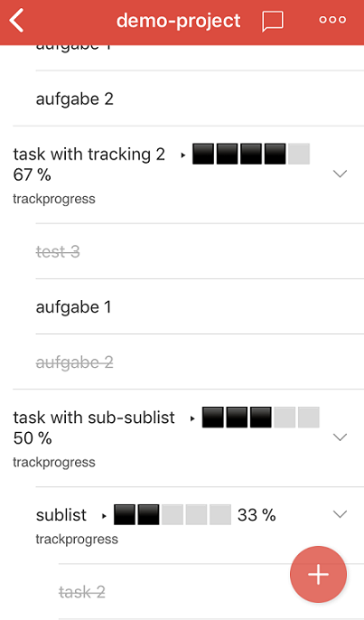

# Todoist-progress

Adds visual progressbars to tasks and lists with subtasks



## Features
- uses unicode symbols for cross-platform support
- adds progressbars lists, sub-lists and individual tasks

## Prerequisites and notes
1. You'll need a [Todoist](https://todoist.com) premium account
2. You'll probably need a basic understanding of Python as this is my first Python project which is probably not bug-free
3. As of today is tested on Windows 10, 64Bit only
4. For optimal use this programm should run periodical on a server/computer to continuously update your tasks
5. This programm updates the "top" task of your task-lists and adds a progress bar to the existing text

**Errors could lead to broken task-descriptions or manual rework**

## Getting Started
1. Add a label named `trackprogress` to each list/task you want to track (only to the "top" task in the list)
2. Download .exe or python project
3. add a config.ini to the same directory as the .exe
4. add the following to the `config.ini`:
```
[config]
apikey=YOURAPIKEY-WITHOUTH-ANY-QUOTES
```
5. open a cmd (Win+R -> cmd) and `cd` into the directory
6. run either 'python todoist_progress.py' or ´todoist_progress.exe`
7. Sample output:


7. Done

## Continuous progress-update
This program updates existing tasks without creating new once. It used the official sync-api and shouldn't cause any trouble while syncing.
To continuously update your tasks run this programm periodical on a server/computer

## Built With

* [Doist/todoist-python](https://github.com/Doist/todoist-python) - The official Todoist Python API library
* [PyInstaller](https://www.pyinstaller.org) - PyInstaller is a program that freezes (packages) Python programs

## Contributing

Please leave a issue in the [issue tracker] (https://github.com/6uhrmittag/todoist-progress/issues)

## Versioning

I use [Github](https://github.com/6uhrmittag/todoist-progress/) for versioning. 

## Authors

* **Marvin Heimbrodt** - *Initial work* - [slashlog.de](https://slashlog.de)
