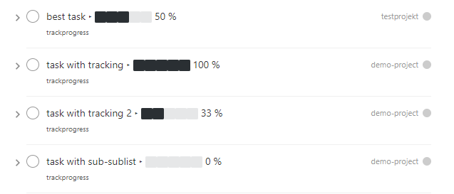
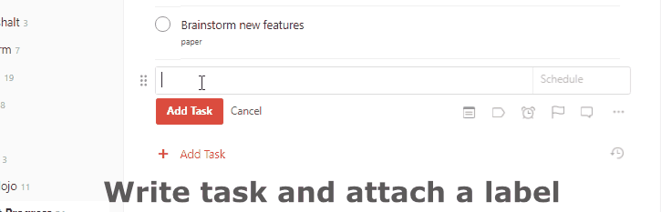
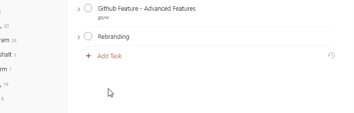

Taskbutler
==========

Taskbutler enriches your Todoist tasks by adding progress bars,
Office365 Files and Dropbox Paper papers directly to your tasks.

|Maintainability| |CodeFactor| ## Features

-  **add progress bars to task-lists in Todoist (unicode,
   cross-plattform)**

   -  Example usage: Create a new task list “File taxes” in your
      “personal” Todoist project. Add the label “progressbar” to the top
      task and always get the status of your taxes at a glance. |Demo
      iOS|

-  **add and link a Word/Office365 template to tasks** (with help of
   your Dropbox)

   -  Example usage: Setup a letter template in Microsoft Word once and
      save it. Once you add the label “letter” to your Todoist task, the
      template gets uploaded to your Dropbox and the task get liked to
      Microsoft Office365. Now, by clicking the task in Todoist,
      Microsoft Word online opens in your browser and you can start
      writing.
      |Feature - Office Online|

-  **add and link Dropbox Paper papers to tasks**

   -  Example usage: Tired of the missing task-note feature in Todoist?
      Add the label “paper” to a task. Now, with a click on the title,
      you’ll get a new Dropbox Paper with all its features just for this
      task. |Feature - Paper|

Prerequisites and notes
-----------------------

**Taskbutler is not associated or connected with Todoist, Dropbox,
Github or Microsoft.**

1. You’ll need a `Todoist`_ premium account
2. The Dropbox Paper and Github features require a free account at
   Dropbox. The Microsoft Office365 feature requires a paid Office365
   subscription(or a free Microsoft Office 365 Education subscription).
3. Taskbutler is tested on Ubuntu
4. For optimal use, Taskbutler should run periodical on a
   server/computer to continuously update your tasks

*Even though I never experienced any data loss, it’s nice to know
that*\ `Todoist provides a daily backup of your data.`_

Setup
-----

install
~~~~~~~

::

   ````bash
   sudo apt-get install python3-pip
   sudo pip3 install --user pipenv
   git clone https://github.com/6uhrmittag/taskbutler.git
   git fetch && git fetch --tags
   git checkout v.2.0.0
   cd taskbutler
   python3 -m venv taskbutler
   source taskbutler/bin/activate
   pip3 install --user -r requirements.txt
   cp config.ini.sample config.ini
   ````

configuration
-------------

Each feature can be disabled by leaving the corresponding labelname in
the config.ini emtpy. Each feature is configured in the config.ini.
Open, edit and save the file to configure Taskbutler.

If you used Taskbutler before and want to change a setting: \***Remember
to stop Ta

.. _Todoist: https://todoist.com
.. _Todoist provides a daily backup of your data.: https://support.todoist.com/hc/en-us/articles/115001799989

.. |Maintainability| image:: https://api.codeclimate.com/v1/badges/02c45c0604ad57ffc504/maintainability
   :target: https://codeclimate.com/github/6uhrmittag/taskbutler/maintainability
.. |CodeFactor| image:: https://www.codefactor.io/repository/github/6uhrmittag/taskbutler/badge
   :target: https://www.codefactor.io/repository/github/6uhrmittag/taskbutler


